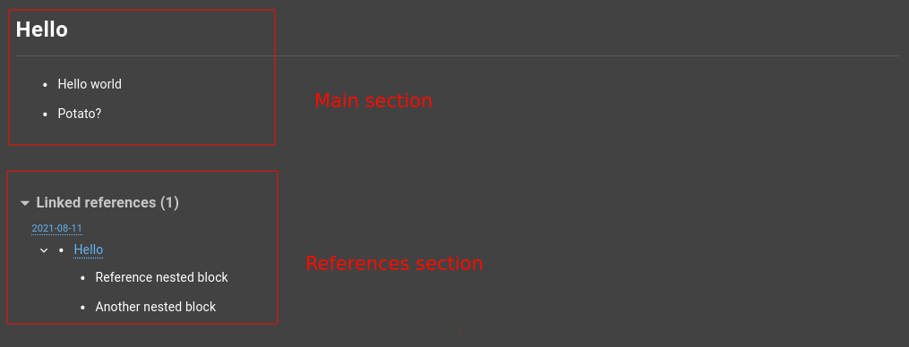
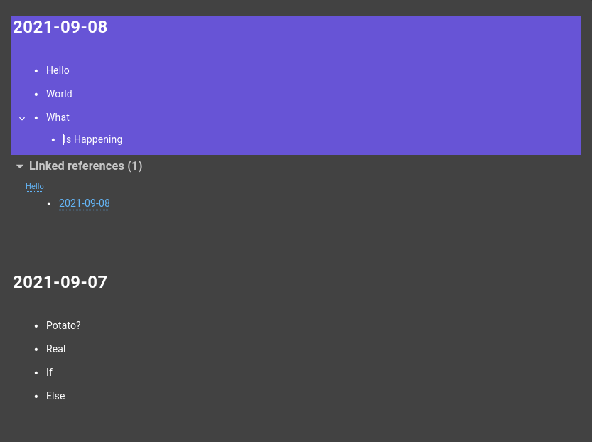

##### [ᐊ Go Home](./NOTES.md#table-of-contents)

<div align="center">

# Notes Block Navigation

This page contains information on how the navigation between separate blocks is performed.
</div>


## Table of Contents
1. [Overview](#overview)
2. [Keeping track of the active block](#keeping-track-of-the-active-block)
3. [Navigation](#navigation)
    1. [V1 (Relying on `BlocksStore.active`](#v1-relying-on-blocksstoreactive)
    2. [V2 (Using the DOM and `BlocksStore.active`)](#v2-using-the-dom-and-blocksstoreactive)
    3. [V3 (Relying on the DOM)](#v3-relying-on-the-dom)
5. [Selections](#selections)


## Overview

The way we keep track of the currently focused block is by using the `active` property in `BlocksStore` which is a mobx observable.

The `BlockEditor` React component listens to changes to this property and focuses its *contenteditable* div when it matches the id of block that's being rendered (Refer to [keeping track of the active block](#keeping-track-of-the-active-block) for more info)

However 

## Keeping track of the active block
As mentioned in [overview](#overview). The way we keep track of the active block is by using a **mobx observable property** in `BlocksStore` to which `BlockEditor` components (which render blocks) listen to for changes, and focuses the rendered block accordingly if the id matches.

The `active` proeprty has the following structure

```ts
type IActiveBlock = {
    id: string, // The id of the focused block
    pos?: 'start' | 'end' | number, // The position of the cursor within the block
    nonce: number, // A unique nonce so we don't double jump the cursor
}
```

Unlike navigation which is performed by using the DOM (see [navigation](#navigation)), selections completely rely on this.

**Note**: The position of the cursor is only updated if `active.pos` is not `undefined`


## Navigation
Implementing block navigation was a complete disaster at the start, we had to rewrite the way it's implemented 3 times.

### V1 (Relying on `BlocksStore.active`)
The way this works is that every time we wanna navigate to an adjacent block we would do the following.

1. Grab the *ID* of the *currently active* block by using `BlocksStore.active`.
2. Grab `BlocksStore.root` (which contains the ID of the root block that is currently being shown on screen) and build an array of all the *expanded* children by doing a *pre-order graph traversal* of the root block by using `BlocksStore.computeLinearTree` (refer to [notes design](./NOTES_DESIGN.md) for more info on the way blocks are stored).
3. Find the *id* the of the *current block* within the array.
4. Get the next/prev item (depending on the direction) and update `BlocksStore.active` with the new *block ID*.

This worked fine for a while. but then we had to support navigating between the main note area and its references using the keyboard. Check screenshot below




One way we could solve this issue is by getting the references of the root block and computing an expansion tree (pre-order graph traversal) of each one of them.
But this was kind of unreliable because it was complicated and required making sure that the references are rendered in the same order.


### V2 (Using the DOM and `BlocksStore.active`)
Steps to navigate to an adjacent block.
1. Grab the *ID* of the *currently active* block by using `BlocksStore.active`.
2. Find the DOM element for that block (see `DOMBlocks.tsx`)
3. Find the sibling block that we're navigating to by traversing the DOM starting from the source element.
4. Update `BlocksStore.active` with the new ID which causes the component that renders the block to focus it & put the cursor in the correct position.

This was a lot better than V1 because now we can navigate between a note and its references seamlessly, and this also allowed us navigate between multiple notes that are shown on the same page.

### V3 (Relying on the DOM)
One issue came up when we started adding annotation block contents to notes is that *flashcards* (specifically front/back flashcards) have *2 editable areas* (front & back) which are associated with the same block ID.
This meant that we can't rely on `BlocksStore.active` to focus blocks. Because we wouldn't know which editable area we're trying to focus.

The steps to navigate between blocks is pretty similar to V2, but the last step is different.
Instead of updating `BlocksStore.active` and letting mobx notify the associated component which in turn does the actual cursor update, we now focus the block immediately by using its DOM element, and we also update `BlocksStore.active` but without setting `active.pos` (because we don't want the component to update the cursor)

One question one may have is that why do we still update `BlocksStore.active`. it's because selections still use this (refer to the [Selections](#selections) section for more info)

**Note:** If we try to navigate down/up and there's no more blocks, we just send the cursor to the start/end of the current block (depending on the direction of the navigation).

## Selections

Unlike [navigation](#navigation) which relies on the DOM. Selections are performed and kept track of in `BlocksStore` by using the following properties

```ts
{
    /**
     * Used so that when we change the selected blocks, that we know which is the
     * FIRST so that we can compute a from and to based on their position.
     */
    selectedAnchor?: string,
    
    /**
     * The blocks that are selected by the user so that they can be highlighted in the UI.
     * Note: This only keeps track of the selected parents. eg: if we have a parent that is selected and it has 3 children. this property would only contain the parent.
     */
    selected: Record<string, boolean>,
    
    /**
     * Keeps track of the currently active block
     */
    active?: IActiveBlock,
}
```

**Note:** If you want more info on `IActiveBlock` refer to [Keeping track of the active block](#keeping-track-of-the-active-block).

Another difference from navigation is that selections are constrained by the root (which is stored in `selectedAnchor`).
That means we cannot select blocks that from multiple roots (notes). Check screenshot below.



In this picture for example (which is taken from the Daily Notes page), we can't extend the selection beyond **2021-09-08** (which is the *root* block of that specific selection).

The way selections are done is similar to how we used to do the [V1 of navigation](#v1-relying-on-blocksstoreactive). It's as simple as.
1. Putting the first selected block in `selectedAnchor` & `selected`.
2. For each consecutive block that is selected we just put it in `selected` and do root constrained navigation.

**Note:** As mentioned before only parents are stored inside of `selected`.
