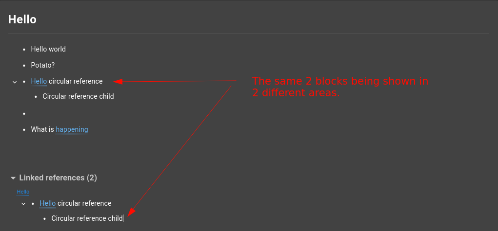

##### [ᐊ Go Home](./NOTES.md#table-of-contents)

# Notes ContentEditable

This section contains info on the notes block editor.

## Table of Contents
1. [Overview](#overview)
2. [Wiki Links](#wiki-links)
3. [Setting innerHTML](#setting-innerhtml)

## Overview

The notes block editor is basically a div with `contenteditable` set to `true`.
**Note:** For more details be sure to check `CursorPositions.ts`, `ContentEditables.ts`, `BlockEditor` & `BlockContentEditable`.

## Wiki Links

Wiki links have `contentEditable` set to `false` this is because we wanna deal with them as one entity so we know when they're deleted (because we need to update the links index and do other stuff).

**Issues**

This approach has many issues that occur when trying to update the position of the cursor because most of the time when trying to put the cursor inside of a `contenteditable=false` element the cursor disappears.

**Solution**

The way we currently handle this issue is that when trying to put the cursor within a `contenteditable=false`
element, we would create an empty text node right after the element and focus that instead.

## Setting innerHTML
Every time we set `innerHTML` on a `contentEditable` element the cursor gets reset to the start.

This becomes an issue when dealing with collaboration because 2 users might edit the same block at the same time.

**Example**

When 2 users are trying to edit the same block, let's say *Bob* has his cursor in the *middle* of a *block*, after that, *Alice* tries to edit the *same block* which causes *Bob's* cursor to *jump* to the start.

This happens because when **Alice** *changes* the content of that *block* and Bob receives the change, we have to set `innerHTML` on *Bob's* with the new content which in turn resets his cursor.

**Solution**

What we're currently doing as a solution to this issue is that right before setting `innerHTML` of a block we would do the following.
1. Save the *current position* of the *cursor*.
2. Update the block's content by setting `innerHTML`.
3. *Restore* the old *position* of the *cursor* that we *saved* earlier.

**Issues**

One issue is that we currently have with this is that the cursor freaks out when dealing with circular references in notes.

To create a circular reference you can insert a link in a child block that references the parent (check screenshot below).

What happens here is that when we try to change the content of a block that is shown in 2 different places,
we have to update the content of the same block in the second place, which means we have to set `innerHTML` on the second one which also means that we have to save/restore the position of the cursor.

So you end up with a cursor that keeps alternating between 2 different `contenteditable` divs.

Two possible solutions to this.
1. Find a way to differentiate between updates coming from our store and updates coming from somewhere else (through collaboration).
    - If an update is coming from our store we don't save/restore our cursor position.
    - If an update is coming from somewhere else we have to save/restore our cursor position.
2. Save a reference to the *DOM elements* of blocks inside of `BlocksStore.active` so that when we want to focus a block we check if the *DOM elements* match (the one in the component that renders the block vs the one coming from `BlocksStore.active`) and only update the cursor if they match.
