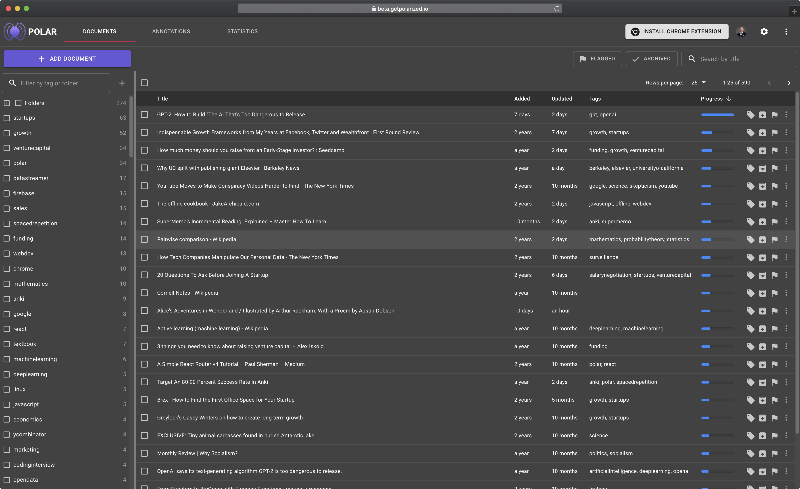
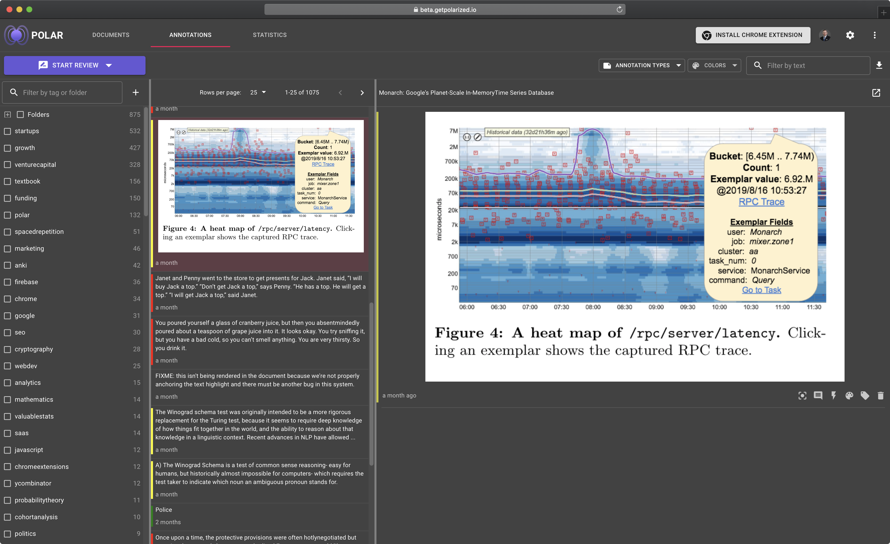

# Getting Started

Polar is an advanced document management and knowledge repository for students, knowledge professionals, and self-learners.

It includes tools to manage documents annotations, and simplify learning from digital sources. It includes flashcards and incremental reading powered by spaced repetition.

# Document Repository

Your starting point in Polar is the document repository.

<!--  -->

This holds all your reading in one place (epub, pdf, webpages), supports tags, folders, filtering for flagged or archived documents, etc.

You can also sort by any column to build reading queues and mix and match the above to build customize your repository.

# Annotation Viewer

When reading your documents with Polar you can create highlights, comment on highlights, (text & area highlights), annotate them, and manage them
using the annotation viewer. The annotation viewer captures your highlights and annotations from all files.

Like the document repository, the annotation viewer allows you to filter the view, sort by columns, etc.

# Pick the Right Platform

Polar supports both desktop and web and supports cloud sync and storage and sync of your across devices.

|             |     | full feature set      |     | offline support |
| ----------- | --- | --------------------- | --- | --------------- |
| **desktop** |     | yes                   |     | yes             |
| **web**     |     | yes                   |     | yes             |
| **mobile**  |     | yes                   |     | yes             |

## Mobile

Mobile includes both tablet and phones running iOS and Android. Polar supports mobile webapps (progressive webapps), with native apps in the works). They can be installed by <a href="https://app.getpolarized.io" target="_blank">visiting the website</a> (and logging in) on your phone.

## Desktop

We have desktop apps for Windows, MacOS, and Linux which you can <a href="https://getpolarized.io/download/" target="_blank">download here</a>.

## Web

The <a href="https://app.getpolarized.io" target="_blank">web version of Polar</a> runs on Chrome, and Firefox [^1] and supports almost all functionality as the desktop app except for offline support which will come in the future.

# Cloud

Polar is a cloud-based app. Every new user gets 1 GB of free storage. Your documents are available across all your devices. Up to 500 GB of storage is available when <a href="https://getpolarized.io/pricing" target="_blank">upgrading</a>.

# Footnotes

1. May not actively work with Safari as of Nov 2019 and our web extension is not available for Firefox.
